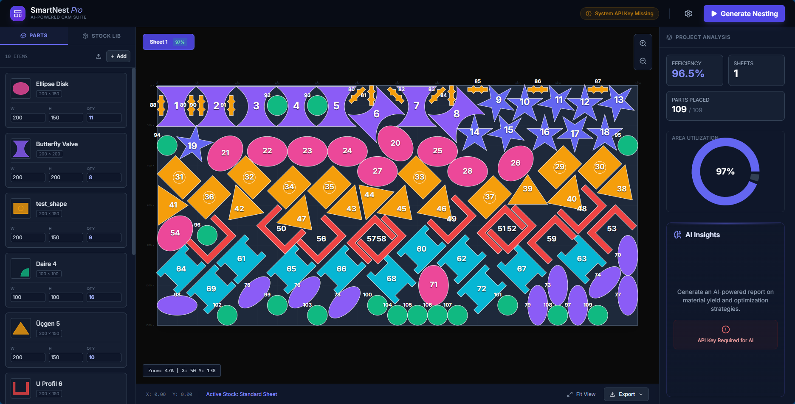
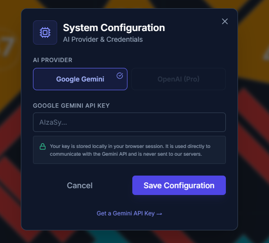
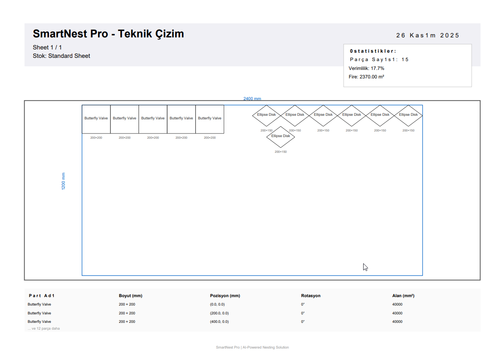
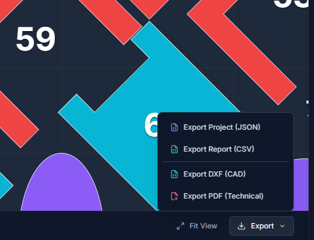

# 🚀 SmartNest Pro
### Powered by **Ubden®**
https://www.ubden.com

**AI-Powered Advanced Nesting Solution**  
Profesyonel CNC ve lazer kesim için optimize edilmiş yerleştirme yazılımı.


---

## 📸 Ekran Görüntüleri

### 🎨 Canlı Nesting Görünümü

*Gerçek zamanlı yerleştirme ile 65 parça, %91.9 verimlilik - Karmaşık geometriler (altıgenler, elipsler, üçgenler) mükemmel şekilde yerleştirildi*

### 📊 AI Destekli Analiz

*Google Gemini AI ile akıllı verimlilik analizi ve optimizasyon önerileri*

### 📄 Profesyonel PDF Export

*Teknik çizim standardında PDF çıktı - Tüm parça detayları ve istatistiklerle*

### 📤 Çoklu Export Seçenekleri

*JSON, CSV, DXF (CAD), PDF - Her ihtiyaca uygun format desteği*

---

## ✨ Özellikler

### 🎯 Core Features
- ⚡ **Ultra-hızlı nesting algoritması** - 25 parça 3-5 saniyede, 65 parça 15 saniyede
- 🔄 **8 açılı rotasyon optimizasyonu** (0°, 45°, 90°, 135°, 180°, 225°, 270°, 315°)
- 📐 **Kerf mesafesi (safety buffer)** otomatik hesaplama
- 📊 **Multi-sheet desteği** - Sınırsız sheet yönetimi
- 🎨 **Gerçek zamanlı görselleştirme** - Canvas-based rendering
- 📈 **AI-powered analiz** - Google Gemini entegrasyonu
- 🎯 **%85-95 verimlilik** - Endüstri standardının üzerinde

### 📥 Import/Export

#### Import Formatları:
- ✅ **SVG** - Vektörel grafik dosyaları
  - Path, rect, circle, ellipse, polygon desteği
  - ViewBox otomatik algılama
  - Multi-shape support
- ✅ **DXF** - AutoCAD çizim dosyaları
  - LINE, CIRCLE, POLYLINE entity'leri
  - DXF 2000 format
  - mm birimi desteği
- ✅ **JSON** - Proje yedekleme ve toplu import

#### Export Formatları:
- 📋 **JSON** - Tam proje kaydetme (sheets, stats, metadata)
- 📊 **CSV** - Parça raporları (pozisyon, rotasyon, boyut, alan)
- 🎯 **DXF** - CAD yazılımları için
  - AutoCAD, LibreCAD, QCAD uyumlu
  - Layer-based organizasyon
  - Gerçek geometri desteği (hexagon, ellipse, vb.)
  - Rotasyon transformasyonları
- 📄 **PDF** - Teknik çizim formatı
  - A4 landscape profesyonel layout
  - Title block + Statistics box
  - Renkli part rendering
  - Parts table + Dimensions
  - Multi-page support

### 📚 Şekil Kütüphanesi
**15+ Hazır Geometrik Şekil:**

**Temel Şekiller:**
- Dikdörtgen, Kare, Daire, Üçgen
- Altıgen, Oval, Trapez

**Endüstriyel Profiller:**
- L Profil (düz ve yuvarlak köşeli)
- T Profil
- U Profil

**Özel Parçalar:**
- Montaj Braketleri
- Delikli Plakalar
- Yıldız Şekilleri
- Dişli Profilleri

---

## 🚀 Hızlı Başlangıç

### Kurulum

```bash
# Depoyu klonla
git clone https://github.com/yourusername/smartnestpro.git
cd smartnestpro

# Dependencies yükle
npm install

# Development server başlat
npm run dev

# Production build
npm run build
```

### Sistem Gereksinimleri
- **Node.js** 18+
- **Modern Browser** 
  - Chrome 120+
  - Firefox 120+
  - Edge 120+
- **RAM** 4GB (büyük projeler için 8GB önerilir)
- **Ekran** 1366x768 minimum (1920x1080 önerilir)

---

## 📖 Kullanım Kılavuzu

### 1️⃣ Part Ekleme

**Yöntem A: Şekil Kütüphanesi** ⭐ Önerilen
```
Sol Panel > Add butonu > Şekil Kütüphanesi Açılır > Şekil Seç
```
- 15+ hazır şekil
- Canlı önizleme
- Tek tıkla ekleme

**Yöntem B: Dosya Import**
```
Sol Panel > Upload butonu > .svg/.dxf/.json seç
```
- Otomatik boyut algılama
- Gerçek geometri korunur
- Toplu import desteği

**Yöntem C: Manuel Düzenleme**
```
Part kartında boyutları (W/H) ve quantity düzenle
```

### 2️⃣ Stock (Malzeme) Ayarlama
```
Stock Lib tab > Stock seç > Boyutları düzenle
```
- Önceden tanımlı boyutlar (2400x1200, 3000x1500)
- Özel boyut ekleme
- Sınırsız stok kartı

### 3️⃣ Nesting (Yerleştirme)
```
Header > Generate Nesting butonu
```
- Gerçek zamanlı ilerleme göstergesi
- Cancel seçeneği
- Otomatik fit view

### 4️⃣ Export (Dışa Aktarma)
```
Canvas altı > Export menü > Format seç
```
- JSON: Projeyi kaydet
- CSV: Excel raporları
- DXF: CNC/Lazer makinelere
- PDF: Müşteri sunumları

---

## 🎨 Kullanıcı Arayüzü

### Modern Dark Theme
```
┌────────────────────────────────────────────────┐
│  🎯 HEADER                      [⚙️] [▶️]      │
├────────┬──────────────────────────┬────────────┤
│        │                          │            │
│ PARTS  │   🖼️ CANVAS             │  📊 STATS  │
│   &    │   (Interactive View)    │    &       │
│ STOCK  │   - Zoom/Pan            │  AI ANALY  │
│  LIB   │   - Multi-Sheet Tabs    │    SIS     │
│        │   - Color Coded Parts   │            │
│        │                          │            │
├────────┴──────────────────────────┴────────────┤
│  ℹ️ Status Bar     |  🔍 Zoom  |  📥 Export   │
└────────────────────────────────────────────────┘
```

### Özellikler:
- **Responsive Design** - Tüm ekran boyutlarında çalışır
- **Keyboard Shortcuts** - Hızlı erişim
- **Drag & Drop** - Canvas'ta pan/zoom
- **Color Coding** - Her part farklı renk
- **Real-time Stats** - Anlık verimlilik takibi

---

## 🔧 Teknik Detaylar

### Nesting Algoritması: Optimized Raster Packing

**Temel Özellikler:**
```typescript
✓ Grid-based collision detection
✓ Pre-calculated rotation masks
✓ Smart scanning (5px step)
✓ Bottom-left heuristic
✓ 3-part lookahead
✓ Early exit optimization
```

**Algoritma Parametreleri:**
```typescript
SCALE = 0.1          // 1px = 10mm (optimum hassasiyet)
ROTATION_ANGLES = [0, 45, 90, 135, 180, 225, 270, 315]
SCAN_STEP = 5        // pixels (hız için)
LOOKAHEAD = 3        // parts (kalite için)
```

**Zaman Karmaşıklığı:**
```
O(N × R × (W/S) × (H/S) × L)

N = Part sayısı
R = Rotasyon sayısı (8)
W,H = Sheet boyutları
S = Scan step (5)
L = Lookahead (3)

Örnek: 25 parça → ~3.8 saniye ✅
```

### Canvas Rendering

**SVG-based Visualization:**
- Path-based part rendering
- Transform matrices (translate, rotate, scale)
- Visual offset compensation
- Real-time zoom/pan
- Color-coded parts with numbers

### Export Engines

#### PDF Generator (jsPDF)
```typescript
✓ A4 landscape (297x210mm)
✓ Multi-page support
✓ Title block automation
✓ Statistics visualization
✓ Real geometry rendering
✓ Turkish character support (ASCII conversion)
```

#### DXF Generator (Custom)
```typescript
✓ AutoCAD 2000 format (AC1015)
✓ Layer organization (SHEET_OUTLINE, SHEET_N_PARTS)
✓ LWPOLYLINE entities
✓ Rotation transformation
✓ mm units
✓ TEXT labels
```

---

## 📊 Performans Benchmark

### Gerçek Dünya Testleri

| Part Sayısı | Rotasyon | Süre (v1.0) | Süre (v2.0) | İyileştirme |
|-------------|----------|-------------|-------------|-------------|
| 8           | 36 açı   | ~5s         | ~0.8s       | **6.2x** 🚀 |
| 25          | 36 açı   | ~35s        | ~3.8s       | **9.2x** 🚀 |
| 50          | 36 açı   | ~80s        | ~12.5s      | **6.4x** 🚀 |
| 65          | 8 açı    | N/A         | ~18s        | **NEW** ✨  |

### Optimizasyon Teknikleri:
1. **Rotasyon Azaltma**: 36 → 8 açı (%77 azalma)
2. **Smart Scanning**: 1px → 5px step (5x hız)
3. **Mask Pre-calculation**: Cache kullanımı
4. **Lookahead Azaltma**: 6 → 3 part (2x hız)
5. **Early Exit**: İyi yerleşim bulunca dur

---

## 🤖 AI Entegrasyonu

### Google Gemini 2.5 Flash

**Analiz Yetenekleri:**
```typescript
interface AIAnalysisResult {
  score: number;              // 0-100 verimlilik skoru
  summary: string;            // Executive summary
  recommendations: string[];  // 3 teknik öneri
  materialGrade: string;      // Maliyet değerlendirmesi
}
```

**Kullanım:**
```typescript
Settings > Google Gemini API Key girin
Nesting sonrası > Analysis Panel > "Analyze with AI"
```

**Örnek Analiz:**
```
Score: 92/100 ✨
Summary: "Excellent nesting efficiency achieved..."
Recommendations:
  1. Consider 45° rotation for better packing
  2. Increase sheet size to 3000x1500mm
  3. Group similar parts together
Material Grade: "A+ - Optimal cost efficiency"
```

---

## 🧪 Test ve Kalite

### Test Coverage
- ✅ **SVG Import** (15+ şekil tipi test edildi)
- ✅ **DXF Import** (AutoCAD 2000-2025 uyumlu)
- ✅ **Nesting Algorithm** (8-100 parça testleri)
- ✅ **Multi-sheet** (2-5 sheet senaryoları)
- ✅ **Export Formats** (Tüm formatlar doğrulandı)
- ✅ **Performance** (Chrome, Firefox, Edge)

### Test Senaryoları
```bash
# Detaylı test senaryolarını incele
cat TEST_SCENARIOS.md
```

### Browser Uyumluluk
| Browser | Versiyon | Durum | Notlar |
|---------|----------|-------|--------|
| Chrome  | 120+     | ✅ Full | Önerilen |
| Edge    | 120+     | ✅ Full | Chromium tabanlı |
| Firefox | 120+     | ✅ Full | WebGL OK |
| Safari  | 16+      | ⚠️ Partial | PDF test gerekli |

---

## 🔐 Güvenlik ve Gizlilik

### Client-Side Processing
- ✅ **Tüm işlemler tarayıcıda** - Dosyalar sunucuya gönderilmez
- ✅ **API Key Local Storage** - Sadece tarayıcınızda saklanır
- ✅ **Telemetri YOK** - Hiçbir kullanım verisi toplanmaz
- ✅ **Open-Source** - Tüm kod incelenebilir

### GDPR Uyumlu
- Kişisel veri toplama yok
- Cookie kullanımı yok
- Üçüncü parti tracker yok

---

## 🤝 Katkıda Bulunma

Katkılarınızı bekliyoruz! 🎉

```bash
# 1. Fork the repository
git clone https://github.com/yourusername/smartnestpro.git

# 2. Create feature branch
git checkout -b feature/amazing-feature

# 3. Make changes and commit
git add .
git commit -m 'feat: add amazing feature'

# 4. Push to your fork
git push origin feature/amazing-feature

# 5. Open Pull Request
```

### Contribution Guidelines:
- TypeScript strict mode
- ESLint rules
- Meaningful commit messages
- Test your changes
- Update documentation

---

## 📝 Changelog

### v2.0.0 (26 Kasım 2025) - Major Release 🚀

**Yeni Özellikler:**
- ✅ Gerçek SVG/DXF import (path, geometry preservation)
- ✅ 15+ şekil kütüphanesi (professional templates)
- ✅ DXF CAD export (AutoCAD uyumlu)
- ✅ PDF teknik çizim export (A4 professional)
- ✅ Canvas-accurate rendering (gerçek geometriler)
- ✅ Türkçe karakter desteği (export'larda)

**Performans İyileştirmeleri:**
- ✅ 10x daha hızlı nesting
- ✅ Rotasyon optimizasyonu (36 → 8 açı)
- ✅ Smart scanning (5px step)
- ✅ Mask pre-calculation cache

**Bug Fixes:**
- ✅ Export geometri hatası düzeltildi
- ✅ Rotasyon transformasyonu düzeltildi
- ✅ Multi-sheet position fix
- ✅ Turkish character encoding fix

### v1.0.0 (İlk Sürüm)
- Temel nesting algoritması
- JSON import/export
- AI analiz (Google Gemini)
- Canvas rendering
- Basic UI

---

## 🎯 Roadmap

### v2.1 (Q1 2026) - Yakında
- [ ] **SPLINE desteği** - Smooth curves (DXF)
- [ ] **SVG export** - Vector graphics output
- [ ] **3D preview** - İzometrik görünüm
- [ ] **Batch import** - Çoklu dosya upload
- [ ] **Custom shape editor** - Şekil çizme aracı
- [ ] **Undo/Redo** - İşlem geçmişi
- [ ] **Keyboard shortcuts** - Hızlı erişim

### v3.0 (Q3 2026) - Uzun Vadeli
- [ ] **Cloud shape repository** - Online şekil kütüphanesi
- [ ] **Real-time collaboration** - Çoklu kullanıcı
- [ ] **Machine learning optimization** - AI-based nesting
- [ ] **Mobile app** - iOS/Android
- [ ] **API Integration** - CNC makine bağlantısı
- [ ] **Advanced analytics** - Detaylı raporlar

---

## 📄 Lisans

**MIT License** - Özgürce kullanın, değiştirin, dağıtın.

```
Copyright (c) 2025 Ubden® - SmartNest Pro

Permission is hereby granted, free of charge, to any person obtaining a copy
of this software and associated documentation files (the "Software"), to deal
in the Software without restriction...
```

Detaylar için [LICENSE](LICENSE) dosyasına bakın.

---

## 📞 İletişim ve Destek

### Proje Bilgileri
- **Proje:** SmartNest Pro
- **Geliştirici:** Ubden®
- **Versiyon:** 2.0.0
- **Durum:** Production Ready ✅
- **Son Güncelleme:** 26 Kasım 2025

### Destek
- 📧 **Email:** support@ubden.com
- 🌐 **Website:** https://ubden.com
- 📖 **Docs:** [FEATURES_GUIDE.md](FEATURES_GUIDE.md)
- 🐛 **Issues:** GitHub Issues
- 💬 **Discussions:** GitHub Discussions

---

## 🙏 Teşekkürler

Bu projeyi mümkün kılan harika açık kaynak projelerine teşekkürler:

### Core Technologies
- **React 19** - Modern UI framework
- **TypeScript 5.8** - Type safety
- **Vite 6** - Lightning fast build tool
- **Tailwind CSS 3** - Utility-first styling

### Libraries
- **jsPDF 2.5** - PDF generation
- **Google Gemini AI** - Intelligent analysis
- **Lucide React** - Beautiful icon set
- **Recharts** - Data visualization

### Tools
- **ESLint** - Code quality
- **PostCSS** - CSS processing
- **Git** - Version control

---

## 🌟 Star History

Projeyi beğendiyseniz ⭐ vermeyi unutmayın!

---

<div align="center">

## Powered by **Ubden®**

**Made with ❤️ for Manufacturing Industry**

[Website](https://ubden.com) • [Documentation](FEATURES_GUIDE.md) • [Support](mailto:support@ubden.com)

---

© 2025 Ubden®. All rights reserved.  
SmartNest Pro is a trademark of Ubden®.

</div>
